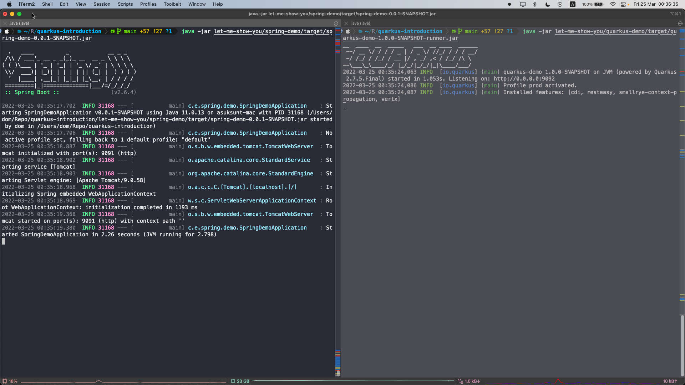

# Introduction To Quarkus

## Prerequisites

1. Docker
2. JDK 11+
3. GraalVM 21.3.0+
4. Maven
5. OpenShift Container Platform

## Demo Scenarios

### 1. Let Me Show You

#### Purpose

This demo aims to show you a comparison between Quarkus and Spring Boot applications how Quarkus is faster, smaller, and more lightweight (low memory consumptions) in JVM running mode.

#### Demo Steps

1. Go to top level of this directory (`quarkus-introduction`).

2. Build and package both applications.

   *Spring Boot:*

   ```sh
   mvn clean install package -DskipTests -f let-me-show-you/spring-demo
   ```

   *Quarkus:*

   ```sh
   mvn clean install package -DskipTests -Dquarkus.package.type=legacy-jar -f let-me-show-you/quarkus-demo
   ```

3. Compare the application artefacts size in the `target` dicrectory in each project. **Quarkus application should be smaller than Spring Boot**.

   *Spring Boot:*

   ```sh
   ls -lh let-me-show-you/spring-demo/target
   ...
   -rw-r--r--  1 dom  staff    17M Mar 24 23:53 spring-demo-0.0.1-SNAPSHOT.jar
   ...
   ```

   *Quarkus:*

   ```sh
   ls -lh let-me-show-you/quarkus-demo/target
   ...
   -rw-r--r--   1 dom  staff   156K Mar 25 00:29 quarkus-demo-1.0.0-SNAPSHOT-runner.jar
   ...
   ```

4. Run both applications in separate terminal windows.

   *Spring Boot:*

   ```sh
   java -jar let-me-show-you/spring-demo/target/spring-demo-0.0.1-SNAPSHOT.jar
   ```

   *Quarkus:*

   ```sh
   java -jar let-me-show-you/quarkus-demo/target/quarkus-demo-1.0.0-SNAPSHOT-runner.jar
   ```

   

5. Look for both application startup times in the logs to compare them. **Quarkus should be faster than Spring Boot.**

6. Run [jps](https://docs.oracle.com/en/java/javase/11/tools/jps.html) command in a new terminal window to get Java process ID of both applications.

   ```sh
   jps

   33045 spring-demo-0.0.1-SNAPSHOT.jar
   33053 quarkus-demo-1.0.0-SNAPSHOT-runner.jar
   ...
   ```

7. Use [jhsdb](https://docs.oracle.com/en/java/javase/11/tools/jhsdb.html) command to get heap information of both applications. Replace the `<PID>` with the process ID from `jps` command output above. Then look at `G1 Heap` section and the `used` attribute (See sample output below.) Then compare the value from both applications. **Quarkus appliation should use less memory than Spring Boot application.**

   *Command:*

   ```sh
   jhsdb jmap --heap --pid <PID>
   ```

   *Sample output:*

   ```sh
   Attaching to process ID 33053, please wait...
   Debugger attached successfully.
   Server compiler detected.
   JVM version is 11.0.13+7-jvmci-21.3-b05

   using thread-local object allocation.
   Garbage-First (G1) GC with 8 thread(s)

   Heap Configuration:
      MinHeapFreeRatio         = 40
      MaxHeapFreeRatio         = 70
      MaxHeapSize              = 8589934592 (8192.0MB)
      NewSize                  = 1363144 (1.2999954223632812MB)
      MaxNewSize               = 5152702464 (4914.0MB)
      OldSize                  = 5452592 (5.1999969482421875MB)
      NewRatio                 = 2
      SurvivorRatio            = 8
      MetaspaceSize            = 21807104 (20.796875MB)
      CompressedClassSpaceSize = 1073741824 (1024.0MB)
      MaxMetaspaceSize         = 17592186044415 MB
      G1HeapRegionSize         = 2097152 (2.0MB)

   Heap Usage:
   G1 Heap:
      regions  = 4096
      capacity = 8589934592 (8192.0MB)
      used     = 76087088 (72.56230163574219MB)
      free     = 8513847504 (8119.437698364258MB)
      0.885770283639431% used
   G1 Young Generation:
   Eden Space:
      regions  = 34
      capacity = 333447168 (318.0MB)
      used     = 71303168 (68.0MB)
      free     = 262144000 (250.0MB)
      21.38364779874214% used
   Survivor Space:
      regions  = 2
      capacity = 4194304 (4.0MB)
      used     = 4194304 (4.0MB)
      free     = 0 (0.0MB)
      100.0% used
   G1 Old Generation:
      regions  = 2
      capacity = 203423744 (194.0MB)
      used     = 589616 (0.5623016357421875MB)
      free     = 202834128 (193.4376983642578MB)
      0.2898462039908183% used
   ```

### 2. CLI Tooling

### 3. Dev UI

### 4. Live Coding

### 5. Dev Services

### 6. Native Executable

### 7. Build Container Image

### 8. Kubernetes Native

### 9. Spring Boot On Quarkus
