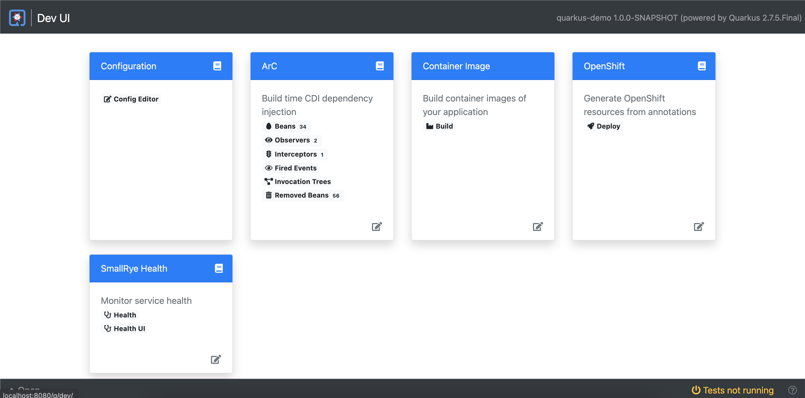
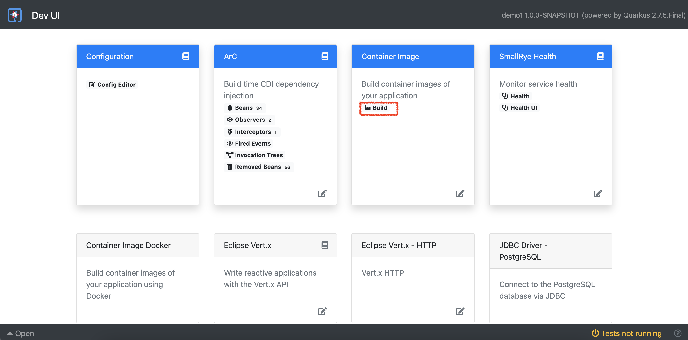
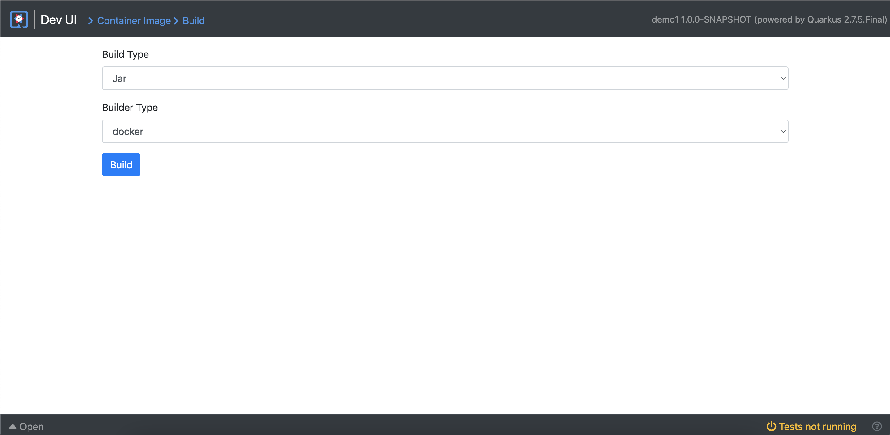

# Introduction To Quarkus

This repository contains demostration guide e.g. scenario, steps and application projects, and other stuff for the **Introduction To Quarkus** presentation.

- [Introduction To Quarkus](#introduction-to-quarkus)
  - [Prerequisites](#prerequisites)
  - [Demo Scenarios](#demo-scenarios)
    - [Let Me Show You](#let-me-show-you)
    - [CLI Tooling](#cli-tooling)
    - [Dev UI](#dev-ui)
    - [Live Coding](#live-coding)
    - [Dev Services](#dev-services)
    - [Native Executable](#native-executable)
    - [Build Container Image](#build-container-image)
    - [Kubernetes Native](#kubernetes-native)
    - [Spring Boot On Quarkus](#spring-boot-on-quarkus)

## Prerequisites

1. Docker
2. JDK 11+
3. GraalVM 21.3.0+
4. Maven
5. OpenShift Container Platform

## Demo Scenarios

### Let Me Show You

Purpose

This demo aims to show you a comparison between Quarkus and Spring Boot applications how Quarkus is faster, smaller, and more lightweight (low memory consumptions) in JVM running mode.

<details>
<summary>Demo Steps</summary>

> **_Speaker Note_**
>
> You can quickly show the code of both projects before starting this demo.

1. Go to top level of this directory (`quarkus-introduction`).

2. Build and package both applications.

   _Spring Boot:_

   ```sh
   mvn clean install package -DskipTests -f let-me-show-you/spring-demo
   ```

   _Quarkus:_

   ```sh
   mvn clean install package -DskipTests -Dquarkus.package.type=uber-jar -f let-me-show-you/quarkus-demo
   ```

3. Compare the application artefacts size in the `target` dicrectory in each project. **Quarkus application should be smaller than Spring Boot**.

   _Spring Boot:_

   ```sh
   ls -lh let-me-show-you/spring-demo/target
   ...
   -rw-r--r--  1 dom  staff    17M Mar 24 23:53 spring-demo-0.0.1-SNAPSHOT.jar
   ...
   ```

   _Quarkus:_

   ```sh
   ls -lh let-me-show-you/quarkus-demo/target
   ...
   -rw-r--r--   1 dom  staff   156K Mar 25 00:29 quarkus-demo-1.0.0-SNAPSHOT-runner.jar
   ...
   ```

4. Run both applications in separate terminal windows.

   _Spring Boot:_

   ```sh
   java -jar let-me-show-you/spring-demo/target/spring-demo-0.0.1-SNAPSHOT.jar
   ```

   _Quarkus:_

   ```sh
   java -jar let-me-show-you/quarkus-demo/target/quarkus-demo-1.0.0-SNAPSHOT-runner.jar
   ```

   

5. Look for both application startup times in the logs to compare them. **Quarkus should be faster than Spring Boot.**

6. Run [jps](https://docs.oracle.com/en/java/javase/11/tools/jps.html) command in a new terminal window to get Java process ID of both applications.

   ```sh
   jps

   33045 spring-demo-0.0.1-SNAPSHOT.jar
   33053 quarkus-demo-1.0.0-SNAPSHOT-runner.jar
   ...
   ```

7. Use [jhsdb](https://docs.oracle.com/en/java/javase/11/tools/jhsdb.html) command to get heap information of both applications. Replace the `<PID>` with the process ID from `jps` command output above. Then look at the `used` attribute in the `G1 Heap` section (See sample output below.) And then compare the values from both applications. **Quarkus appliation should use less memory than Spring Boot application.**

   **_Note._** Building Quarkus applicaiton using [fast-jar](https://quarkus.io/guides/maven-tooling#fast-jar) will cause the application consumes slightly less memory than the legacy jar and uber jar.

   _Command:_

   ```sh
   jhsdb jmap --heap --pid <PID>
   ```

   _Sample output:_

   ```sh
   Attaching to process ID 33053, please wait...
   Debugger attached successfully.
   Server compiler detected.
   JVM version is 11.0.13+7-jvmci-21.3-b05

   using thread-local object allocation.
   Garbage-First (G1) GC with 8 thread(s)

   Heap Configuration:
      MinHeapFreeRatio         = 40
      MaxHeapFreeRatio         = 70
      MaxHeapSize              = 8589934592 (8192.0MB)
      NewSize                  = 1363144 (1.2999954223632812MB)
      MaxNewSize               = 5152702464 (4914.0MB)
      OldSize                  = 5452592 (5.1999969482421875MB)
      NewRatio                 = 2
      SurvivorRatio            = 8
      MetaspaceSize            = 21807104 (20.796875MB)
      CompressedClassSpaceSize = 1073741824 (1024.0MB)
      MaxMetaspaceSize         = 17592186044415 MB
      G1HeapRegionSize         = 2097152 (2.0MB)

   Heap Usage:
   G1 Heap:
      regions  = 4096
      capacity = 8589934592 (8192.0MB)
      used     = 76087088 (72.56230163574219MB)
      free     = 8513847504 (8119.437698364258MB)
      0.885770283639431% used
   G1 Young Generation:
   Eden Space:
      regions  = 34
      capacity = 333447168 (318.0MB)
      used     = 71303168 (68.0MB)
      free     = 262144000 (250.0MB)
      21.38364779874214% used
   Survivor Space:
      regions  = 2
      capacity = 4194304 (4.0MB)
      used     = 4194304 (4.0MB)
      free     = 0 (0.0MB)
      100.0% used
   G1 Old Generation:
      regions  = 2
      capacity = 203423744 (194.0MB)
      used     = 589616 (0.5623016357421875MB)
      free     = 202834128 (193.4376983642578MB)
      0.2898462039908183% used
   ```

[↩ back to top](#1-let-me-show-you)

</details>

### CLI Tooling

Purpose

To demonstrate some cool features of Quarkus CLI tool that helps to improve developers productivity.

<details>
<summary>Demo Steps</summary>

> **_Speaker Note_**
>
> You can mention that the developers don't have to use Quarkus CLI if they don't prefer to. Developers can still use **Maven** or **Gradle** to build their project. For other tasks, they just do whatever they've been doing. Quarkus CLI just a tool that helps develpers to get more convenience.

1. Create a project.

   ```sh
   quarkus create quarkus-demo
   ```

2. Take a look in the project directory, sample code, readme, dockerfile should be created.

3. Add a dependency.

   ```sh
   quarkus extension add kubernetes
   ```

4. Add a depencency with ambigous name.

   ```sh
   quarkus extension add hibernate postgresql
   ```

5. Then take a look at the POM or Gradle file in the project. There should be new dependencies added.

6. Remove dependencies.

   ```sh
   quarkus extension remove quarkus-hibernate-orm-panache quarkus-jdbc-postgresql
   ```

7. Check the POM or Gradle file again, the dependencies should have gone.

8. Build project.

   ```sh
   quarkus build
   ```

9. Run project in `dev` (live coding) mode. This will also open port `5005` for remote debugging.

   ```sh
   quarkus dev
   ```

10. Take a look at the shortcut and menu in the terminal. Then press `W` on keyboard to open the application URL.

[↩ back to top](#2-cli-tooling)

</details>

### Dev UI

Purpose

This demo aims to show the **Dev UI** feature which is a dashboard that's available in `dev` mode at `/q/dev` URL by default e.g. [http://localhost:8080/q/dev](http://localhost:8080/q/dev). It allows you to quickly visualize all the extensions currently loaded, see their status and go directly to their documentation.

<details>
<summary>Demo Steps</summary>

1. Run a project in `dev` mode.

   ```sh
   quarkus dev
   ```

2. Press `D` on keyboard. The **Dev UI** page will be opened automatically in a web browser.

   

3. Take a look at the **Configuration** widget, you can edit application properties at run time will reflect to the `application.properties` file without restarting application. Also, the **ArC** widget that has a few menu to view Beans, Observers, Interceptors etc. in the DI container.

   There are also the other widgets for some extensions that you can use to view documents, edit extension specific configurations as well.

4. Usually, microservice application should have the URL to get health status (health checks) and metrics of application for monitoring.

   Add health checks and metrics extension, re run the application and open **Dev UI** again to see the health check widget.

   ```sh
   quarkus extension add health
   ```

   ```sh
   quarkus extension add metric
   ```

   ```sh
   quarkus extension add quarkus-smallrye-health quarkus-smallrye-metrics
   ```

5. Run the application and open **Dev UI** again to see the health checks widget.

   

6. Open:

   1. [http://localhost:8080/q/health/live](http://localhost:8080/q/health/live) to check liveness.
   2. [http://localhost:8080/q/health/ready](http://localhost:8080/q/health/ready)to check readiness.
   3. [http://localhost:8080/q/health/started](http://localhost:8080/q/health/started) to check whether the application is started.

7. Open [http://localhost:8080/q/metrics](http://localhost:8080/q/metrics) to see all metrics exposed by the application.

[↩ back to top](#3-dev-ui)

</details>

### Live Coding

Purpose

The intention of this demo is to demonstarte the **Live Coding** feature of Quarkus. This feature helps to reduce times to start/stop application during development work on develper machine. Live Coding allow you to write or edit the code at runtime and the change will reflect immediately without stop and start the application again.

<details>
<summary>Demo Steps</summary>

1. Start the application in `dev` mode. And open [http://localhost:8080/hello](http://localhost:8080/hello) in a web browser.

   ```sh
   quarkus dev
   ```

2. Make some code change i.e. returned message. Then refresh the web browser. The change will reflect immediately without restart the build.

[↩ back to top](#4-live-coding)

</details>

### Dev Services

Purpose

The intention of this demo is to show how Quarkus supports the automatic provisioning of unconfigured services in development and test mode which is so called [Dev Services](https://quarkus.io/guides/dev-services).

<details>
<summary>Demo Steps</summary>

1. Run the **Producer** application in [`dev-services/kafka-quickstart-producer`](dev-services/kafka-quickstart-producer) directory. And wait until the application is un and running. The Kafa dev service should get started automatically.

   ```sh
   quarkus dev
   ```

2. Run the **Processor** application in [`dev-services/kafka-quickstart-processor`](dev-services/kafka-quickstart-processor) directory. And wait until the application is un and running.

   ```sh
   quarkus dev
   ```

3. Go to the terminal you ran the **Producer** application then press `W` on keyboard to open a web page.

4. Click on the `quote.html` URL.

5. Demo the app.

[↩ back to top](#5-dev-services)

</details>

### Native Executable

Purpose

This demo aims to show one of Quarkus's capabilities - native executable build. Quarkus can build a project with a special mode - `native`, to get an application executable file with native machine code. The advantage is the application will start faster alot than running in JVM mode.

<details>
<summary>Demo Steps</summary>

1. Build the project with native paramenter.

   ```sh
   mvn clean package -DskipTests -Pnative
   ```

2. Run the application with native executable file in the `target` directory.

   ```sh
   ./target/demo1-1.0.0-SNAPSHOT-runner
   ```

3. Observe the superfast startup time in the first line of logs.

   ```txt
   __  ____  __  _____   ___  __ ____  ______
   --/ __ \/ / / / _ | / _ \/ //_/ / / / __/
   -/ /_/ / /_/ / __ |/ , _/ ,< / /_/ /\ \
   --\___\_\____/_/ |_/_/|_/_/|_|\____/___/
   2022-03-28 11:31:56,254 INFO  [io.quarkus] (main) demo1 1.0.0-SNAPSHOT native (powered by Quarkus 2.7.5.Final) started in 0.079s. Listening on: http://0.0.0.0:8080
   2022-03-28 11:31:56,254 INFO  [io.quarkus] (main) Profile prod activated.
   2022-03-28 11:31:56,254 INFO  [io.quarkus] (main) Installed features: [cdi, jdbc-postgresql, kubernetes, resteasy, smallrye-context-propagation, smallrye-health, smallrye-metrics, vertx]
   ```

[↩ back to top](#6-native-executable)

</details>

### Build Container Image

Purpose

Usually, microservice application is packaged and deployed with container technology. So, building the container image is one of the tasks that develoepers need to to during develpoment process to test and deploy the application on their machine.

This demo will show you how develpers can easily build various type of container images via **Dev UI** uisng Docker extension.

<details>
<summary>Demo Steps</summary>

> **_Speaker Note_**
>
> Mention that usually, developers will build a container image after they've done developement work in local machine to test the application deployment and a few checks before they push the code changes to source control i.e. Git. With Quarkus extensions i.e. Docker they can build the container image via **Dev UI** without writing the `Dockerfile` (it was generated automatically since the projected was created) and using the `docker build...` command.

1. Add a Docker extension to the project.

   ```sh
   quarkus extension add docker
   ```

2. Run the project in **dev** mode.

   ```sh
   quarkus dev
   ```

3. Open **Dev UI** dashboard by pressing `D` on keyboard. Then click on **build**.

   

4. Select the build option and click on **Build** button.

   

5. Go back to terminal and observe the logs.

   ```txt
   2022-03-28 11:43:05,769 INFO  [io.qua.con.ima.doc.dep.DockerProcessor] (build-3) Starting (local) container image build for jar using docker.
   2022-03-28 11:43:05,772 INFO  [io.qua.con.ima.doc.dep.DockerProcessor] (build-3) Executing the following command to build docker image: 'docker build -f /Users/dom/Temp/demo1/src/main/docker/Dockerfile.jvm -t dom/demo1:1.0.0-SNAPSHOT /Users/dom/Temp/demo1'
   2022-03-28 11:43:07,903 INFO  [io.qua.con.ima.doc.dep.DockerProcessor] (build-3) #1 [internal] load build definition from Dockerfile.jvm
   2022-03-28 11:43:07,904 INFO  [io.qua.con.ima.doc.dep.DockerProcessor] (build-3) #1 sha256:38382a805c9ca2a3f6c8240eeb3aa21207690c019095351943aa0096388f8a9f
   2022-03-28 11:43:07,904 INFO  [io.qua.con.ima.doc.dep.DockerProcessor] (build-3) #1 transferring dockerfile: 5.29kB 0.0s done
   2022-03-28 11:43:07,905 INFO  [io.qua.con.ima.doc.dep.DockerProcessor] (build-3) #1 DONE 0.0s
   2022-03-28 11:43:07,905 INFO  [io.qua.con.ima.doc.dep.DockerProcessor] (build-3)
   2022-03-28 11:43:07,905 INFO  [io.qua.con.ima.doc.dep.DockerProcessor] (build-3) #2 [internal] load .dockerignore
   2022-03-28 11:43:07,906 INFO  [io.qua.con.ima.doc.dep.DockerProcessor] (build-3) #2 sha256:51f59eaa8b92dcfc198959f084cacd96bb7ace28b8636f7fdd5584cdb08827d6
   2022-03-28 11:43:07,914 INFO  [io.qua.con.ima.doc.dep.DockerProcessor] (build-3) #2 transferring context: 115B done
   2022-03-28 11:43:07,914 INFO  [io.qua.con.ima.doc.dep.DockerProcessor] (build-3) #2 DONE 0.0s
   2022-03-28 11:43:07,916 INFO  [io.qua.con.ima.doc.dep.DockerProcessor] (build-3)
   2022-03-28 11:43:07,916 INFO  [io.qua.con.ima.doc.dep.DockerProcessor] (build-3) #3 [internal] load metadata for registry.access.redhat.com/ubi8/openjdk-11:1.11
   2022-03-28 11:43:07,917 INFO  [io.qua.con.ima.doc.dep.DockerProcessor] (build-3) #3 sha256:301e98e83faf119c95663e3f5e3f3c2978aef98761cc9e2783115a7c0873eeaa
   2022-03-28 11:43:11,814 INFO  [io.qua.con.ima.doc.dep.DockerProcessor] (build-3) #3 DONE 3.8s
   2022-03-28 11:43:11,815 INFO  [io.qua.con.ima.doc.dep.DockerProcessor] (build-3)
   2022-03-28 11:43:11,815 INFO  [io.qua.con.ima.doc.dep.DockerProcessor] (build-3) #4 [1/5] FROM registry.access.redhat.com/ubi8/openjdk-11:1.11@sha256:6fa59a5318004aef86441ea6765ebed2a43589cd521a15b1d76120a0b3cc484b
   2022-03-28 11:43:11,816 INFO  [io.qua.con.ima.doc.dep.DockerProcessor] (build-3) #4 sha256:0c7f13ed443735447f3f4189497cffaad3b9c367af8ff8a2a0eb2064bdb561c8
   2022-03-28 11:43:11,817 INFO  [io.qua.con.ima.doc.dep.DockerProcessor] (build-3) #4 DONE 0.0s
   .....
   .....
   ```

6. Run the container built from the previous step.

   ```sh
   docker run --rm -i -p 9091:8080 <container image>
   ```

7. Open [http://localhost:9091](http://localhost:9091) in a web browser.

[↩ back to top](#7-build-container-image)

</details>

### Kubernetes Native

Purpose

To demonstrate the single-step deployments Quarkus makes it easy to deploy microservice applications to Kubernetes without having to understand the intricacies of the underlying Kubernetes framework. Though, this demo is going to deploy an application to OpenShift cluster rather a vanilla Kubernetes cluster.

<details>
<summary>Demo Steps</summary>

[↩ back to top](#8-kubernetes-native)

1. Remove docker extension from the project.

   ```sh
   quarkus extension remove docker
   ```

2. Add OpenShift extension to the project.

   ```sh
   quarkus add openshift
   ```

3. Login to OpenShift Console, hen create a new project e.g. `test`, and then grab the login command.

4. Go to terminal and execute the login command.

5. Set default project.

   ```sh
   oc project test
   ```

6. Build and deploy application on OpenShift

   ```sh
   quarkus build -Dquarkus.kubernetes.deploy=true \
   -Dquarkus.kubernetes-client.trust-certs=true \
   -Dmaven.test.skip=true
   ```

7. Wait until it finished.

   ```txt
   [INFO] [io.quarkus.container.image.openshift.deployment.OpenshiftProcessor] Successfully pushed image-registry.openshift-image-registry.svc:5000/test/demo1@sha256:7a4fc2eaa73bd722a79f1c1123b9f1badcbcdb71a983f51ed441d9fb81fc2226
   [INFO] [io.quarkus.container.image.openshift.deployment.OpenshiftProcessor] Push successful
   [INFO] [io.quarkus.kubernetes.deployment.KubernetesDeployer] Deploying to openshift server: https://api.cluster-qx9qw.qx9qw.sandbox1821.opentlc.com:6443/ in namespace: test.
   [INFO] [io.quarkus.kubernetes.deployment.KubernetesDeployer] Applied: Service demo1.
   [INFO] [io.quarkus.kubernetes.deployment.KubernetesDeployer] Applied: ImageStream demo1.
   [INFO] [io.quarkus.kubernetes.deployment.KubernetesDeployer] Applied: ImageStream openjdk-11.
   [INFO] [io.quarkus.kubernetes.deployment.KubernetesDeployer] Applied: BuildConfig demo1.
   [INFO] [io.quarkus.kubernetes.deployment.KubernetesDeployer] Applied: DeploymentConfig demo1.
   [INFO] [io.quarkus.deployment.QuarkusAugmentor] Quarkus augmentation completed in 206660ms
   ```

8. Expose a new route for the application.

   ```sh
   oc expose svc <service name>
   ```

9. Go to OpenShift Console, **Topology** menu. Then open a application link.

</details>

### Spring Boot On Quarkus

Purpose

The intention of this demo is to show how to migrate existing Spring Boot applcation to Quarkus without changing any code (though, dependencies and application properties need to be added). The demo is from and uses this [Spring Boot on Quarkus: Magic or madness?](https://developers.redhat.com/blog/2021/02/09/spring-boot-on-quarkus-magic-or-madness) article. Take a look at the article to get better understanding.

<details>
<summary>Demo Steps</summary>

1. The demo project requires a PostgreSQL database so run it with this Docker command.

   ```sh
   docker run --ulimit memlock=-1:-1 -it --rm=true --memory-swappiness=0 --name tododb -e POSTGRES_USER=todo -e POSTGRES_PASSWORD=todo -e POSTGRES_DB=tododb -p 5432:5432 postgres:13
   ```

2. Run the application.

   ```sh
   ./mvnw clean spring-boot:run
   ```

   The application should run with Spring Boot framework.

   ```txt
   10:58:52.816 [Thread-0] DEBUG org.springframework.boot.devtools.restart.classloader.RestartClassLoader - Created RestartClassLoader org.springframework.boot.devtools.restart.classloader.RestartClassLoader@26e6c1ba

   .   ____          _            __ _ _
   /\\ / ___'_ __ _ _(_)_ __  __ _ \ \ \ \
   ( ( )\___ | '_ | '_| | '_ \/ _` | \ \ \ \
   \\/  ___)| |_)| | | | | || (_| |  ) ) ) )
   '  |____| .__|_| |_|_| |_\__, | / / / /
   =========|_|==============|___/=/_/_/_/
   :: Spring Boot ::                (v2.6.3)

   2022-03-28 10:58:53.474  INFO 27863 --- [  restartedMain] i.q.todospringquarkus.TodoApplication    : Starting TodoApplication using Java 11.0.13 on asuksunt-mac with PID 27863 (/Users/dom/Repo/todo-spring-quarkus/target/classes started by dom in /Users/dom/Repo/todo-spring-quarkus)
   2022-03-28 10:58:53.475  INFO 27863 --- [  restartedMain] i.q.todospringquarkus.TodoApplication    : No active profile set, falling back to default profiles: default
   2022-03-28 10:58:53.561  INFO 27863 --- [  restartedMain] .e.DevToolsPropertyDefaultsPostProcessor : Devtools property defaults active! Set 'spring.devtools.add-properties' to 'false' to disable
   2022-03-28 10:58:53.562  INFO 27863 --- [  restartedMain] .e.DevToolsPropertyDefaultsPostProcessor : For additional web related logging consider setting the 'logging.level.web' property to 'DEBUG'
   2022-03-28 10:58:54.787  INFO 27863 --- [  restartedMain] .s.d.r.c.RepositoryConfigurationDelegate : Bootstrapping Spring Data JPA repositories in DEFAULT mode.
   2022-03-28 10:58:54.846  INFO 27863 --- [  restartedMain] .s.d.r.c.RepositoryConfigurationDelegate : Finished Spring Data repository scanning in 45 ms. Found 1 JPA repository interfaces.
   2022-03-28 10:58:55.702  INFO 27863 --- [  restartedMain] o.s.b.w.embedded.tomcat.TomcatWebServer  : Tomcat initialized with port(s): 8080 (http)
   2022-03-28 10:58:55.715  INFO 27863 --- [  restartedMain] o.apache.catalina.core.StandardService   : Starting service [Tomcat]
   2022-03-28 10:58:55.715  INFO 27863 --- [  restartedMain] org.apache.catalina.core.StandardEngine  : Starting Servlet engine: [Apache Tomcat/9.0.56]
   2022-03-28 10:58:55.811  INFO 27863 --- [  restartedMain] o.a.c.c.C.[Tomcat].[localhost].[/]       : Initializing Spring embedded WebApplicationContext
   2022-03-28 10:58:55.811  INFO 27863 --- [  restartedMain] w.s.c.ServletWebServerApplicationContext : Root WebApplicationContext: initialization completed in 2248 ms
   2022-03-28 10:58:56.218  INFO 27863 --- [  restartedMain] o.hibernate.jpa.internal.util.LogHelper  : HHH000204: Processing PersistenceUnitInfo [name: default]
   2022-03-28 10:58:56.267  INFO 27863 --- [  restartedMain] org.hibernate.Version                    : HHH000412: Hibernate ORM core version 5.6.4.Final
   2022-03-28 10:58:56.433  INFO 27863 --- [  restartedMain] o.hibernate.annotations.common.Version   : HCANN000001: Hibernate Commons Annotations {5.1.2.Final}
   2022-03-28 10:58:56.530  INFO 27863 --- [  restartedMain] com.zaxxer.hikari.HikariDataSource       : HikariPool-1 - Starting...
   2022-03-28 10:58:56.641  INFO 27863 --- [  restartedMain] com.zaxxer.hikari.HikariDataSource       : HikariPool-1 - Start completed.
   2022-03-28 10:58:56.670  INFO 27863 --- [  restartedMain] org.hibernate.dialect.Dialect            : HHH000400: Using dialect: org.hibernate.dialect.PostgreSQL10Dialect
   2022-03-28 10:58:57.218  WARN 27863 --- [  restartedMain] o.h.engine.jdbc.spi.SqlExceptionHelper   : SQL Warning Code: 0, SQLState: 00000
   2022-03-28 10:58:57.218  WARN 27863 --- [  restartedMain] o.h.engine.jdbc.spi.SqlExceptionHelper   : table "todo" does not exist, skipping
   2022-03-28 10:58:57.221  WARN 27863 --- [  restartedMain] o.h.engine.jdbc.spi.SqlExceptionHelper   : SQL Warning Code: 0, SQLState: 00000
   2022-03-28 10:58:57.221  WARN 27863 --- [  restartedMain] o.h.engine.jdbc.spi.SqlExceptionHelper   : sequence "hibernate_sequence" does not exist, skipping
   2022-03-28 10:58:57.239  INFO 27863 --- [  restartedMain] o.h.t.schema.internal.SchemaCreatorImpl  : HHH000476: Executing import script 'file:/Users/dom/Repo/todo-spring-quarkus/target/classes/import.sql'
   2022-03-28 10:58:57.244  INFO 27863 --- [  restartedMain] o.h.e.t.j.p.i.JtaPlatformInitiator       : HHH000490: Using JtaPlatform implementation: [org.hibernate.engine.transaction.jta.platform.internal.NoJtaPlatform]
   2022-03-28 10:58:57.252  INFO 27863 --- [  restartedMain] j.LocalContainerEntityManagerFactoryBean : Initialized JPA EntityManagerFactory for persistence unit 'default'
   2022-03-28 10:58:57.650  WARN 27863 --- [  restartedMain] JpaBaseConfiguration$JpaWebConfiguration : spring.jpa.open-in-view is enabled by default. Therefore, database queries may be performed during view rendering. Explicitly configure spring.jpa.open-in-view to disable this warning
   2022-03-28 10:58:57.897  INFO 27863 --- [  restartedMain] o.s.b.a.w.s.WelcomePageHandlerMapping    : Adding welcome page: class path resource [META-INF/resources/index.html]
   2022-03-28 10:58:58.791  INFO 27863 --- [  restartedMain] o.s.b.d.a.OptionalLiveReloadServer       : LiveReload server is running on port 35729
   2022-03-28 10:58:58.797  INFO 27863 --- [  restartedMain] o.s.b.a.e.web.EndpointLinksResolver      : Exposing 2 endpoint(s) beneath base path '/actuator'
   2022-03-28 10:58:58.841  INFO 27863 --- [  restartedMain] o.s.b.w.embedded.tomcat.TomcatWebServer  : Tomcat started on port(s): 8080 (http) with context path ''
   2022-03-28 10:58:58.859  INFO 27863 --- [  restartedMain] i.q.todospringquarkus.TodoApplication    : Started TodoApplication in 6.021 seconds (JVM running for 6.797)
   ```

3. Open [http://localhost:8080](http://localhost:8080) in a web browser.

4. Play around with the application a bit; Add new todo lists, mark some of them completed, and open the links at the bottom of the page.

5. Go back to the terminal and stop the application by pressing `Ctrl + C` on keyboard.

6. Start the application again with this command.

   ```sh
   ./.mvnw clean spring-boot:run
   ```

   The application should be now start with Quarkus framework.

   ```txt
   2022-03-28 10:56:41,090 INFO  [io.qua.dat.dep.dev.DevServicesDatasourceProcessor] (build-10) Dev Services for the default datasource (postgresql) started.
   2022-03-28 10:56:41,094 INFO  [io.qua.hib.orm.dep.HibernateOrmProcessor] (build-21) Setting quarkus.hibernate-orm.database.generation=drop-and-create to initialize Dev Services managed database
   __  ____  __  _____   ___  __ ____  ______
   --/ __ \/ / / / _ | / _ \/ //_/ / / / __/
   -/ /_/ / /_/ / __ |/ , _/ ,< / /_/ /\ \
   --\___\_\____/_/ |_/_/|_/_/|_|\____/___/
   2022-03-28 10:56:42,761 WARN  [org.hib.eng.jdb.spi.SqlExceptionHelper] (JPA Startup Thread: <default>) SQL Warning Code: 0, SQLState: 00000

   2022-03-28 10:56:42,762 WARN  [org.hib.eng.jdb.spi.SqlExceptionHelper] (JPA Startup Thread: <default>) table "todo" does not exist, skipping
   2022-03-28 10:56:42,766 WARN  [org.hib.eng.jdb.spi.SqlExceptionHelper] (JPA Startup Thread: <default>) SQL Warning Code: 0, SQLState: 00000
   2022-03-28 10:56:42,767 WARN  [org.hib.eng.jdb.spi.SqlExceptionHelper] (JPA Startup Thread: <default>) sequence "hibernate_sequence" does not exist, skipping
   2022-03-28 10:56:42,996 INFO  [io.quarkus] (Quarkus Main Thread) todo-spring-quarkus 0.0.1-SNAPSHOT on JVM (powered by Quarkus 2.6.3.Final) started in 8.111s. Listening on: http://0.0.0.0:8080
   2022-03-28 10:56:42,996 INFO  [io.quarkus] (Quarkus Main Thread) Profile dev activated. Live Coding activated.
   2022-03-28 10:56:42,997 INFO  [io.quarkus] (Quarkus Main Thread) Installed features: [agroal, cdi, hibernate-orm, hibernate-orm-panache, jdbc-postgresql, kubernetes, micrometer, narayana-jta, resteasy-reactive, resteasy-reactive-jackson, smallrye-context-propagation, smallrye-health, smallrye-openapi, spring-data-jpa, spring-di, spring-web, swagger-ui, vertx]
   2022-03-28 10:56:57,312 INFO  [io.quarkus] (Shutdown thread) todo-spring-quarkus stopped in 0.053s
   ```

7. Explain the magic.
   1. Dependencies in POM file e.g. quarkus profile.
   2. Application configuration in `src/main/resources/application.properties` (Scroll down to the bottom to see Quarkus's configs).

[↩ back to top](#9-spring-boot-on-quarkus)

</details>
